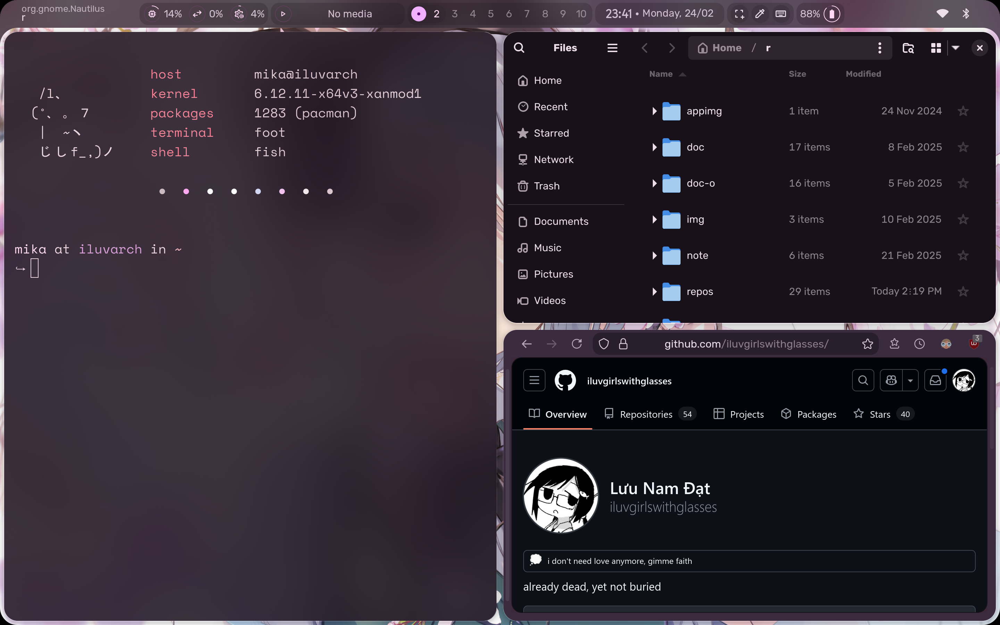

This fork survives to keep the old looks and feels of illogical impulse intact. I just simply prefer the vibrant, glassy feels of the old illogical impulse.


<details>
  <summary>View Desktop Showcase</summary>
  
</details>


# Install

You'd need to do two steps:

1. Get some extra dependencies from the AUR:

```
yay -S anyrun-git gjs gradience gtksourceview3 python-material-color-utilities xorg-xrandr yad
yay -S waterfox-bin     # (optional) this is the default browser of this fork
```

2. Install [patched AGS v1](https://github.com/iluvgirlswithglasses/ags-v1) (please pray that my patch doesn't break)

